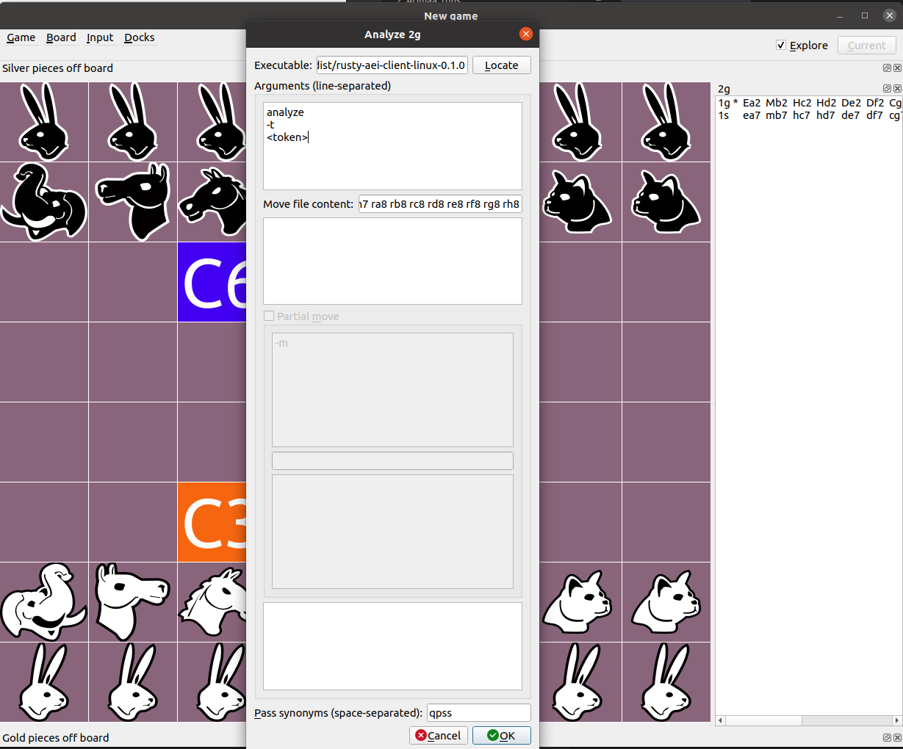
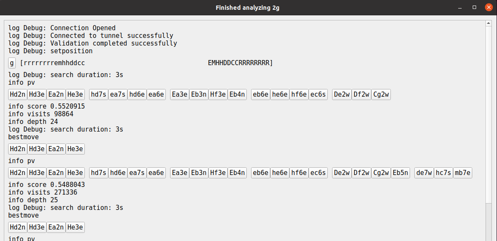

# Rusty Remote Client

The rusty remote client allows for rusty to be used remotely on any machine. The client will connect to a remote server and proxy commands on your behalf. This allows rusty to be used with popular interfaces like the [Janzert AEI] as well as [4steps].

## Token

A token is used to authenticate the remote client with the proxy. To get a token, simply go to the [Arimaa Discord Server][Discord] and use the command `!rusty token` to generate a token. When using the commands below, replace any instances of `<token>` with the token that you received.

```shell
!rusty token
> rbt_980ce16fb61247e5b79cb58b5ab22a3c
```

## Download

To get the latest remote client, download the client from the [releases] section.

## Use

Rusty remote client is AEI compatible which means that it can be used with most clients. Here are some examples on how to use rusty with some of those clients.

### Command Line

To use rusty in the command line using the [AEI protocol].

```shell
rusty-aei-client-linux-0.1.0 aei -t <token>
newgame
go
makemove Da2 Hb2 Mc2 Dd2 Ee2 Cf2 Cg2 Hh2 Ra1 Rb1 Rc1 Rd1 Re1 Rf1 Rg1 Rh1
```

To analyze a move_file.txt

```shell
rusty-aei-client-linux-0.1.0 analyze ./move_file.txt -t <token>
```

### Janzert AEI

The rusty client can be used with [Janzert AEI]. This includes `analyze`, `gameroom`, and `roundrobin`.

Just update the corresponding config like so.

```yml
[global]
# bot section to use
default_engine = bot_rusty

# Log level can be ERROR, WARNING, INFO or DEBUG
log_level = DEBUG

[bot_rusty]
communication_method = stdio
cmdline = ./rusty-aei-client-linux-0.1.0 aei -t <token>
```

### 4Steps

The rusty client can be used with [4Steps] to analyze and explore a position. To do this:

1. **Right click** the board in 4steps and select **Run analysis** from the menu.
2. Press the **Locate** button and select the rusty client.
3. Fill out the **Arguments** section like so. Be sure to replace `<token>` with your actual `rbt_*` token.

    ```txt
    analyze
    -t
    <token>
    ```

4. Uncheck partial move if it is selected. This is currently not supported.
5. Click **OK**
6. Click the move buttons in the output to update your position.




[Janzert AEI]: <https://github.com/Janzert/AEI> "Janzert AEI"
[AEI Protocol]: <https://github.com/Janzert/AEI/blob/master/aei-protocol.txt> "AEI Protocol"
[4steps]: <https://github.com/TFiFiE/4steps> "4steps"
[discord]: <https://discord.com/invite/YCH3FSp> "Discord"
[releases]: </releases/latest> "Release"